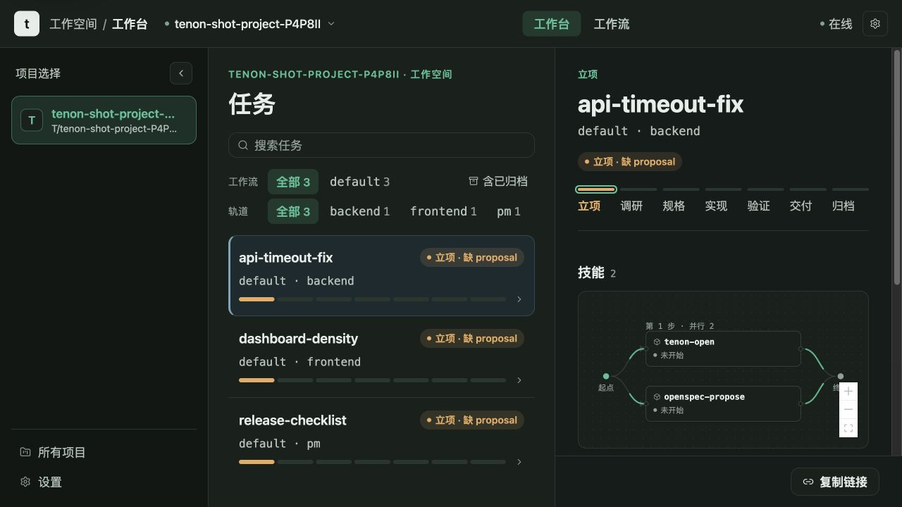
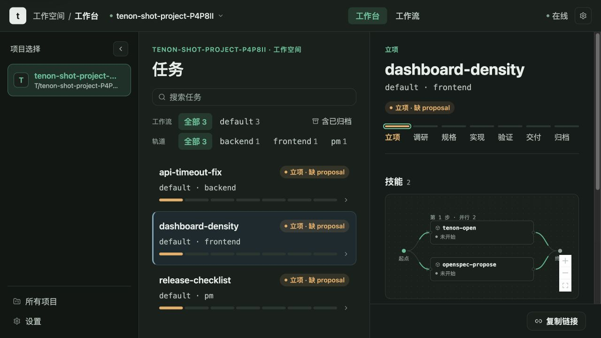
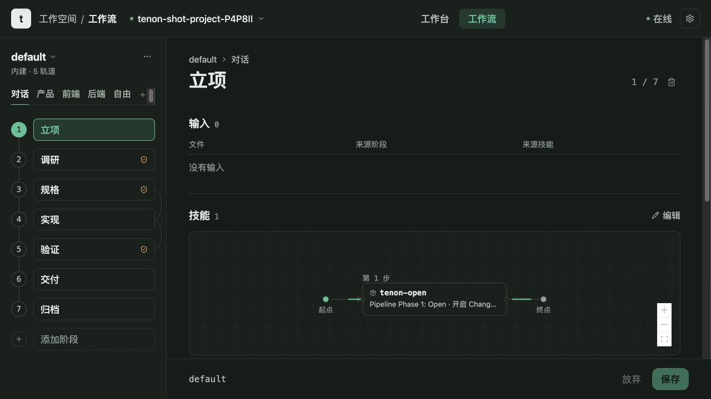

# Tenon

面向 coding agent 的本地优先工作流治理：显式状态、真实 Skill 来源证据、精确复核收据，以及始终展示实际 Workflow 的 Dashboard。

[在线中文文档](https://jefferysha.github.io/tenon/) · [English](README.en.md) ·
[仓库内中文文档](docs/usage/zh-CN/index.md) · [English guide](docs/usage/README.md) ·
[安全](SECURITY.md) · [参与贡献](CONTRIBUTING.md) · [MIT License](LICENSE)

Tenon 是一个完整打包的插件，不是“CLI 加一份需要手工安装的 Skills 清单”。发布包包含声明式 Workflow、OpenSpec 证据规则、分阶段 Skills、hooks、CLI、本地 Dashboard、自动化控制和多宿主 adapters。

它解决 agent 工作中常见的错位：对话说了一套，任务状态、Todo、文档和实际工具执行却是另一套。Tenon 让这些界面共享同一份 Effective Workflow Plan，并拒绝无效转换，而不是从对话文本猜测进度。



<p align="center"><sub>一个本地控制面，统一查看项目、真实流程和需要人工处理的事项。</sub></p>

## 它改变了什么

| 没有工作流治理 | 使用 Tenon |
| --- | --- |
| 旧任务可能仅因为“最近”而被恢复。 | 只有请求明确标识或要求恢复某个 Change 时才恢复它。 |
| 通用 Todo 可能与真实流程漂移。 | Todo 和 Dashboard 步骤来自所选 Workflow。 |
| Prompt 可以声称执行过 Skill 或读过文档。 | 系统校验当前访问的 Skill、文档摘要、读取、复核和转换收据。 |
| 所有任务都被迫经过同一套重流程。 | 讨论、Simple、Default、Free 和 Custom 有不同且显式的结果。 |
| “支持某宿主”可能掩盖能力差异。 | Adapter 公布上下文注入、阻断和 Skill 留痕的 A/B/C 保真度。 |

## 选择正确的执行路径

| 路径 | 适用场景 | 形态 | 文档行为 |
| --- | --- | --- | --- |
| Discussion | 问答、解释、系统通知、斜杠命令 | 不创建 Change | 无受治理文档 |
| Simple | 命中正向清单且不命中排除项的明确低风险修改 | `change → verify → done` 或 `escalated` | 不启用默认 OpenSpec 契约 |
| Default | 产品、前端、后端、调研、修复、功能和重构 | `open → explore → spec ⇄ build ⇄ verify → ship → archive` | 完整默认文档证据链 |
| Free Track | 显式选择、不叠加 PM/前端/后端覆盖层的中性实现 | 所选 Workflow | 仍遵守该 Workflow 的门禁和文档契约 |
| Custom Workflow | 项目自定义声明式流程 | 与编写的图完全一致 | 只执行已声明的文档契约；未声明则无文档治理 |

Simple 路由刻意保持严格。API 或公共契约、schema 和 migration、认证或安全、依赖、发布、生产数据、跨模块工作和新功能即使只改一行，也不会进入 Simple。

[了解路由与 Workflow →](docs/usage/zh-CN/routing-and-workflows.md)

## Dashboard 一览

| 流程进度 | 工作流 |
| --- | --- |
|  |  |
| Todo、阶段、门禁和执行来源保持同源。 | 工作流编辑器展示 Track、阶段和运行前事实。 |

| 工作台设置 |
| --- |
|  |
| 默认、自定义与自由模式共享同一套可检查编排。 |

Dashboard 顶部只保留流程进度与工作流两个高频入口；主题和语言从设置菜单切换。宿主计划、AFK
和机器诊断继续由 CLI 与本地 API 提供，只读预览不会执行命令。

[查看 Dashboard 完整图文指南 →](docs/usage/zh-CN/dashboard-and-local-api.md)

## 安装

### 前置要求

- Node.js 22 或更高版本
- Git
- 一个明确选择的宿主 CLI；Codex 用户可先运行 `npm install -g @openai/codex`，再用 `codex --version` 验证
- 只有使用 AFK 容器执行时才需要 Docker

新用户无需 clone 仓库。一次安装完整 Codex 插件：

```bash
/usr/bin/curl -fsSL https://raw.githubusercontent.com/jefferysha/tenon/v1.1.0/install.sh | /bin/bash -s -- --codex
```

Claude Code 用户只替换宿主参数：

```bash
/usr/bin/curl -fsSL https://raw.githubusercontent.com/jefferysha/tenon/v1.1.0/install.sh | /bin/bash -s -- --claude
```

先预览 Codex 的完整 Marketplace 与包内 setup 计划、且不调用宿主或写入用户目录：

```bash
/usr/bin/curl -fsSL https://raw.githubusercontent.com/jefferysha/tenon/v1.1.0/install.sh | /bin/bash -s -- --codex --dry-run
```

该命令始终从不可变稳定版本 `v1.1.0` 安装预构建发行资产，不 clone 仓库、不运行源码编译。
Bootstrap 注册 Tenon Marketplace、安装同一个完整插件、校验发行 payload，并执行
`tenon setup --<host>`。已经安装后的维护入口仍是 `tenon setup --codex`、`tenon update --codex`
与 `tenon runtime status`。

如果当前是已发布的 `v1.0.1`，请把固定的 `v1.0.2/install.sh` 命令作为一次性迁移桥执行一次。
`v1.0.1` 的旧 launcher 只会派发一次旧 updater，无法在同一命令中安全重绑新的版本标签；因此不把
第二次命令或 Dashboard/校验脚本副作用伪装成一键升级。从 `v1.0.2` 起，之后每次常规升级都只需运行
一条 `tenon update --codex`（或 `--claude`），且始终以稳定 release tag 为交付身份。

安装会启动并等待 Dashboard 就绪。curl/CI 安装不会自动打开浏览器，而会打印已验证 URL；需要时运行
`tenon dashboard --open`。交互式终端中的首次 `tenon setup` 可以自动打开，手动或后台更新不会。

Codex 插件安装与账号认证是两个独立步骤。安装完成后，Tenon 只读运行
`codex login status`，不会自动登录或读取凭证内容。若尚未登录：

```bash
# ChatGPT 方案包含 Codex 时
codex login

# 远程或无浏览器环境
codex login --device-auth

# Platform API Key（先在 https://platform.openai.com/api-keys 创建）
printenv OPENAI_API_KEY | codex login --with-api-key

# 复核
codex login status
```

ChatGPT 方案登录通常无需另设 API Key；Platform API 使用单独的 API Key 与按量计费。不要把 Key
直接写进命令参数、日志或 Issue。

需要自动跟随后续发行版时显式启用每日检查：

```bash
tenon setup --codex --auto-update
```

Marketplace 是当前公开的一步安装入口；薄 npx 包已经纳入发布流水线，但只有拥有的 npm scope
真正发布后才会公布准确包名。旧身份用户由独立的 migration-only 仓库迁移，Tenon 主包不保留旧命令。

Codex setup 完成后，在 Codex 中运行 `/hooks` 并信任一次 `tenon`。然后新开宿主会话，使打包的 hooks 和 Skills 被加载。

```bash
tenon runtime status
tenon doctor
tenon dashboard --open
```

生产 Dashboard 是位于 `http://127.0.0.1:18765/` 的单一本地 SPA 和 API。另一个 Vite 端口只用于前端开发。

[安装、全部宿主与生命周期 →](docs/usage/zh-CN/installation.md)

## 第一个受治理任务

完成 setup 和 hook 信任后，在正常对话中直接提出真实工作：

```text
为项目切换器添加键盘导航并编写测试。
```

路由器会为讨论跳过治理、选择严格的 Simple 路径，或在合适的 Track 上创建新的受治理 Change。它不会静默恢复无关旧 Change。

检查结果：

```bash
tenon list --json
tenon status <change-name> --json
tenon document status <change-name>
tenon dashboard --open
```

要恢复已知 Change，请在对话中明确说出它，或显式激活：

```bash
tenon session activate <change-name>
```

[完整五分钟教程 →](docs/usage/zh-CN/quickstart.md)

## Default Workflow 如何获得推进资格

```text
open → explore → spec ⇄ build ⇄ verify → ship → archive
          复核     复核          复核
                     ↑               │
                     └ 需求变化      └ 验证失败 → build
```

Default Workflow 治理以下文档：

- Open：proposal、OpenSpec design 和 tasks
- Explore：Superpowers design 和 ADR
- Spec：delta specification 和实现计划
- Verify：verification report
- Ship：applied specification

后续阶段为其消费的文档登记当前读取收据。文档由当前 agent 通过要求的阶段 Skills 编写；只初始化状态不会自动产生有意义的内容。Ledger 把每个受治理文件绑定到内容摘要、producer 证据、Change、阶段访问和后续读取。

Review 出口与确切 transition event 绑定：

```bash
tenon review request <change-name> --event <event>
tenon review acknowledge <change-name>
tenon transition <change-name> <event>
```

持续委托可以被记录，但不会豁免文档、Skills、guards、复核证据、安全边界、发布权限、费用或外部副作用。

[Default Workflow →](docs/usage/zh-CN/default-workflow.md) ·
[文档、Skills 与证据 →](docs/usage/zh-CN/documents-skills-and-evidence.md)

## 宿主 Adapter 保真度

Tenon 提供 12 个宿主目标，并显式标注执行保真度：

| 档位 | 宿主 | 含义 |
| --- | --- | --- |
| A | Claude Code、Codex、Gemini CLI、Continue CLI、Cline、Amp | 上下文注入、阻断和留痕均有原生等价能力 |
| B | Cursor、GitHub Copilot coding agent、Pi、Aider | 一项或多项能力使用明确降级或更晚的执行点 |
| C | Devin、Zed | 静态指导加人工 CLI 收据；没有原生硬阻断 hook |

重要边界：

- Codex 需要一次本机 hook 信任。
- Continue 支持指 Continue CLI，而不是 IDE extension。
- Pi 的 veto 是 advisory；Aider 的 veto 在 commit 而不是写盘时发生。
- Amp 按 adapter 能力属于 A 档，但其 payload 细节尚未在有凭证的真实 Amp 会话中端到端验证。

[完整宿主矩阵 →](docs/usage/zh-CN/installation.md)

## 产品界面

| 界面 | 职责 |
| --- | --- |
| CLI | Setup、runtime 生命周期、Change 状态、转换、复核、证据、Tracks、自动化与诊断 |
| Kernel | Workflow/Track 编译、状态、guards、ledgers、锁、CAS 和 loop policy |
| Hooks 与 adapters | 上下文注入、工具调用前阻断、Skill 留痕和宿主安装 |
| Dashboard | 在同一 loopback server 上提供项目、进度、AFK、配置、机器诊断与只读宿主计划 |
| AFK 与 loops | 可选沙箱工作、准入、预算、并发和 L1/L2/L3 升档 |
| Channel | 高级 event-sourced worker 通信；不修改 canonical Tenon state |
| Memory bridge | 只读本地会话发现和上下文提取 |
| Tap | 显式 opt-in 的本地流量诊断；捕获的 prompt、header 和 token 属敏感数据 |

## 文档

- [使用手册索引](docs/usage/zh-CN/index.md)
- [安装与宿主选择](docs/usage/zh-CN/installation.md)
- [快速开始](docs/usage/zh-CN/quickstart.md)
- [路由与 Workflows](docs/usage/zh-CN/routing-and-workflows.md)
- [Default Workflow 与复核](docs/usage/zh-CN/default-workflow.md)
- [Custom Workflows 与 Tracks](docs/usage/zh-CN/custom-workflows-and-tracks.md)
- [文档、Skills 与证据](docs/usage/zh-CN/documents-skills-and-evidence.md)
- [Dashboard 与本地 API](docs/usage/zh-CN/dashboard-and-local-api.md)
- [AFK 与 loop 治理](docs/usage/zh-CN/automation-and-loops.md)
- [高级工具](docs/usage/zh-CN/advanced-tools.md)
- [更新、恢复与卸载](docs/usage/zh-CN/updates-recovery-and-uninstall.md)
- [故障排查](docs/usage/zh-CN/troubleshooting.md)
- [安全模型](docs/usage/zh-CN/security-model.md)
- [CLI 参考](docs/usage/zh-CN/cli-reference.md)
- [贡献者开发](docs/usage/zh-CN/contributor-development.md)

## 本地安全边界

Dashboard 绑定 loopback、校验本地 Host header、为 mutation 使用随机 handshake token、限制 JSON request body，并把文件操作限制在已注册项目根。受管 release 在激活前按内容寻址并重新校验。

这是本地单用户工作站模型，不是远程多租户控制面，也不声称防御同一 OS 用户下所有恶意进程。Tap interception 默认关闭。

CI 与 pre-tag release candidate 都运行 `npm run check:dependencies`。该单一门禁同时执行
High/Critical advisory audit 和 `npm ls --all` 完整解析树校验。正式发布必须先
对精确、仍为最新 `main` 的 40 位 SHA 手动运行 **Release candidate (pre-tag)**，并传入新 tag；
若恢复已中断发布，也可传入已精确指向同一 SHA 的现有 tag。只读验证 job
不会持有远端写凭据，并要求该 SHA 的 canonical push CI 已成功；全部构建、测试和打包也在这里完成，
输出由规范化后的 GitHub artifact digest 与逐资产 SHA-256 清单绑定的 payload。默认分支拥有的
`workflow_run` writer 会重新验证仓库、workflow、run、artifact 与 SHA；它不 checkout、不执行
仓库代码、不运行 npm lifecycle，只用最小写权限创建或恢复 tag，并校验或补齐 GitHub Release
资产。已存在 tag 仅在 peeled commit 与获批 SHA 精确一致时可幂等继续。发布自动化不执行
`npm publish`；可选 npx 包只作为 GitHub Release 资产。

[安全模型 →](docs/usage/zh-CN/security-model.md) ·
[私密报告漏洞 →](SECURITY.md)

## 从源码开发

仓库是 npm workspace，不对外声称已发布全局 npm CLI。

```bash
git clone https://github.com/jefferysha/tenon.git
cd tenon
npm ci
npm run build
npm test
npm run test:web
bash tools/test-hooks.sh
bash tools/test-adapters.sh
bash tools/verify-skills.sh
bash tools/test-bundle.sh
```

### Bundled Skill provenance

`templates/skill-sources.yaml` is the one tracked provenance registry for every
distributed Skill. It is schema v3 (`hash_algorithm: tree-sha256-v1`): each
entry declares `source_kind: bundled`, a normalized `source_ref`, the
canonical `sha256:` content hash, and an immutable coordinate containing the
same identity and digest. The historical `skills-lock.json` is removed and
must not be reintroduced.

After changing a bundled Skill, refresh the registry explicitly and inspect
the diff:

```bash
npm run sync:skill-provenance
bash tools/verify-skills.sh --quiet --root "$PWD"
```

The hidden packaged command `tenon internal-skill-provenance verify|sync
--root <path> [--json]` is the implementation behind these checks. `verify`
is read-only; `sync` computes all entries before atomically replacing the
registry. Setup, doctor, release candidates, and bundled lookup fail closed on
an invalid registry, missing/extra Skill, legacy lock, or content drift.

修改契约、生成资产、adapters、hooks 或分发文件前，请阅读 [CONTRIBUTING.md](CONTRIBUTING.md)。

## 项目状态与社区

Tenon 1.0 起，用户可见插件 manifest、workspace packages、Git tag 与可选 npx 发布包使用同一版本号。
文档描述当前 release 上已验证的行为；本地 Dashboard 不是托管服务，也不承诺远程 SLA。

- 问题和非敏感故障：[支持](SUPPORT.md)
- Patch 与设计修改：[参与贡献](CONTRIBUTING.md)
- 社区行为约定：[行为准则](CODE_OF_CONDUCT.md)
- 漏洞：[安全政策](SECURITY.md)
- License：[MIT](LICENSE)
