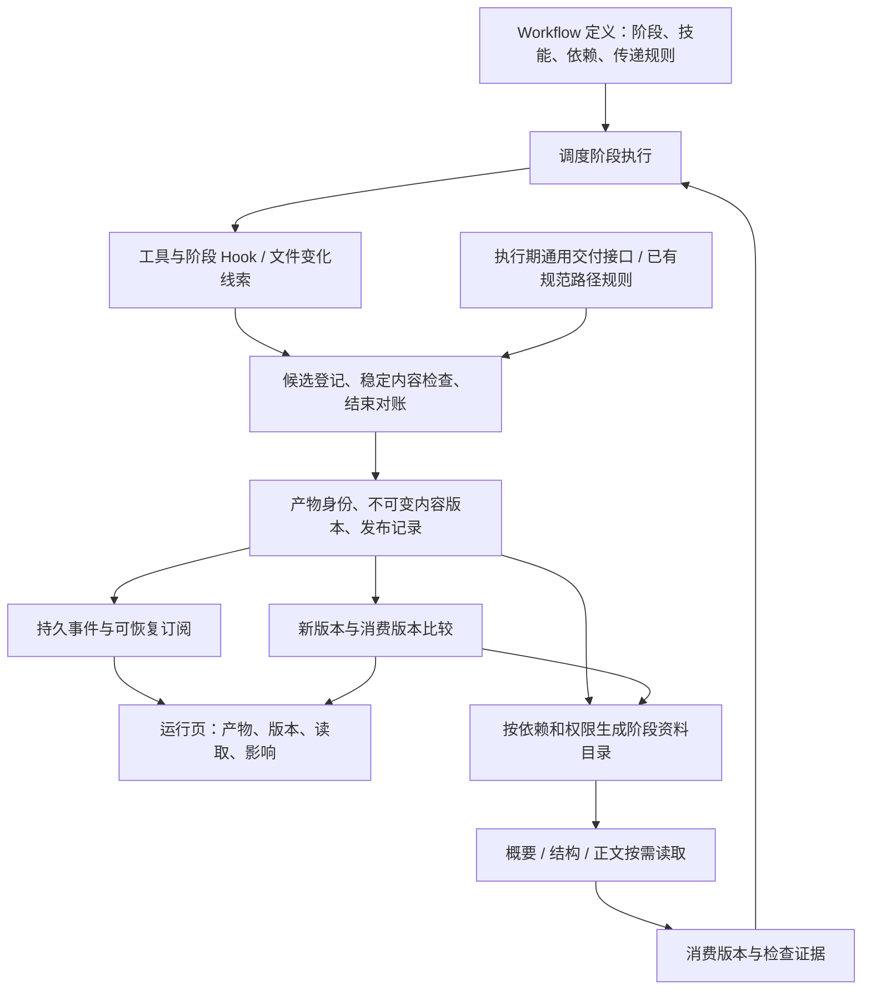

# 工作流编排与执行期产物管理

## 1. 推荐结论

推荐采用**执行期产物登记、内容版本与消费关系、按需上下文读取**。编排 UI 只管理阶段、技能、依赖和资料传递策略；模型参与业务执行，文件出现后才进入运行时产物目录。对没有机器声明的 skill，不把模型解析 I/O 设为安装、选择或保存 workflow 的前置条件。

具体文件属于某次运行的事实，应该主要出现在运行页。编排页可以展示确实已有的配置参数和显式文档契约，但不默认要求填写或推断每个 skill 的输入输出路径。历史运行的文件可以作为带运行标识的参考，不能成为新运行的保证。

这项选择匹配开放技能生态，也保留必要的约束：约束对象是产物记录的结构、可取得的内容版本、发布资格、下游可见性及检查证据。业务完成标准继续来自实际任务、已有流程规则或显式插件契约；仅有文件事件无法证明所有业务要求均已完成。

| 候选方案 | 适用性与代价 | 本轮选择 |
| --- | --- | --- |
| 安装或选择时让模型解析全部 skill I/O | 有解析成本；任务尚未确定，仍无法保证具体文件 | 不作为前置条件 |
| 每个 skill 强制补 manifest | 适合受控插件；第三方存量和开放任务改造成本高 | 保留为可选增强 |
| 只监听文件变化 | 接入简单；无法区分最终交付，覆盖与归属存在缺口 | 用于候选发现 |
| 执行期观察 + 统一交付 + 内容版本 + 消费关系 | 不要求改写所有 skill；需建设一套宿主公共能力 | 推荐作为基础方案 |

以下分工构成完整方案：

| 组成 | 负责什么 | 不承担什么 |
| --- | --- | --- |
| Workflow 定义 | 阶段依赖、技能引用、运行策略、资料继承范围 | 预测未知 skill 将创建的文件名 |
| Hook / 执行器观察适配器 | 采集真实读写、返回值、调用身份和阶段边界 | 把每个发生变化的文件直接认定为正式交付 |
| 产物登记与版本存储 | 内容快照、摘要、身份、状态、事件和发布记录 | 靠路径字符串证明内容质量 |
| 阶段上下文目录 | 计算本阶段可发现的资料，提供摘要和按需读取 | 将所有上游文件全文塞进模型上下文 |
| 消费与检查记录 | 记录读取版本、派生关系和检查适用性 | 仅因时间相近就认定因果或实际生产者 |
| UI 运行视图 | 展示观察、交付、读取、版本差异和受影响阶段 | 充当与模型协商 I/O 的对话入口 |

## 2. 一手资料给出的关键依据

### 2.1 DeepSeek Harness：统一交付入口与渐进目录

固定快照的 Harness 已有 `present`，执行者在文件存在后调用它登记最终交付，支持从 shell 生成、再由 Session 文件系统访问的文件。工具检查路径和普通文件属性，并在成功的工具结果事件后追加交付记录；它不要求每个 skill 分别注册交付工具。这直接支持“执行时统一登记”的方向。该实现保存路径，未保存不可变内容，移动、删除或改写会影响后续打开；持久版本仍是其明确未完成的部分。[^1]

它的技能目录还有另一条可复用思路：每个模型步骤前读取当前可见目录，比较目录摘要，内容变化时发布表示完整替代目录的新消息；具体 skill 正文仍按需加载。替代的是当前目录语义，不等于清除了持久会话中的旧消息。将这一机制迁移到产物目录是本方案的推论，Harness 的这段代码本身处理的是技能目录。[^2]

文件观察服务提供已知路径的读写和消失信息，但受管文件系统之外的 shell、子进程或用户编辑可能不被覆盖。其文件状态观测也不能自动成为不可变文件版本。具体源码边界见协议核对记录。[^3]

### 2.2 MCP Resources：稳定接口、动态资源实例

MCP Resources 将资源列表和内容读取分开，并提供可选的列表变化与资源更新通知。宿主决定怎样把资源纳入上下文。这适合实现可发现的产物目录，而不要求为每个新文件安装一个函数。通知只是需要刷新或读取的信号，不等于正文已进入模型，更没有提供本系统所需的完整历史版本与消费失效策略。[^4]

本方案据此选择：接口/schema 保持稳定，运行中增加资源记录；模型通过固定的 list / inspect / read 能力取得所需内容。只有新增一种受支持的数据格式或检查器时，才需要注册相应内容 schema 或处理器。

### 2.3 A2A：任务状态与产物更新分离

A2A 的任务对象、产物对象和产物更新事件分开表达，产物可在任务尚未终结时更新。它提供流式交付结构；本系统还需自行决定草稿可见范围、发布资格、存储可靠性与业务验收。[^5]

### 2.4 Hook 与文件监听的实际边界

Claude Code 当前文档区分工具调用后的 hook 与文件变化 hook：仅匹配 Write/Edit 不能覆盖 Bash 或外部进程的写入；文件观察可通过已知路径和动态 watchPaths 扩展，但不代表自动发现全部未知输出。上下文反馈要在后续模型请求或会话轮次被消费，不能等同当前推理立即更新。异步 hook 不能作为已完成操作的前置拦截器。[^6]

Node 文件监听也存在跨平台、文件替换、网络文件系统与缺失文件名等限制。由此推导，监听应作为增量变化线索，再用内容检查和阶段边界对账确认，不应作为唯一账本。[^7]

### 2.5 Koishi / Cordis 与运行关系模型

Koishi 的配置 schema 可以驱动确定性配置表单；Cordis 的服务依赖、插件作用域、事件与清理有助于组织观察器和处理器。业务产物版本、历史重放和下游消费关系仍需要独立实现。不同版本的同名事件方法语义可能不同，不能直接把事件派发解释为持久化工作流。[^8]

OpenLineage 将作业、运行与数据集分开建模，并允许运行事件补充输入输出。官方运行周期说明动态作业的输出可能只能通过累积事件逐步补齐；固定 2-0-2 schema 的 RunEvent 与 JobEvent 均不要求 inputs/outputs 必填。它支持“运行时积累真实输入输出关系”的建模方向，不意味着底层自动识别任意 shell 的文件访问。[^9]

Koishi/Cordis 的动态能力挂载也不应直接用于每个产物：文件是数据实例，观察器和格式检查器才是服务。上游文件改动是否触发下游复核，由 workflow 策略决定，不能借用服务重载让消费者阶段自动重启。

## 3. 架构与运行链路



Workflow 定义不因新增一个文件而改写。变化的是某次运行的产物目录，以及各阶段在当前依赖和可见性策略下获得的资料视图。只有阶段、依赖或执行策略发生变化，才产生 workflow 定义修订。

整个系统沿用宿主绑定的 workflow run、stage attempt 和执行 actor。skill 名是方法信息；只有存在精确调用关联时才细化到 skill invocation。一个阶段使用多个 skill 时，不按最后读取的 SKILL.md 抢占产物归属。

登记者、发布者与原始生产者也应分开。阶段可以发布既有资料或外部结果；这证明它声明了交付，不证明它创建了源文件。来源未知可以登记，但生产者仍保持未知。

## 4. Hook 采集采用三层组合

### 4.1 增量观察

受管写入/编辑工具返回后，采集目标路径、操作种类、tool call、actor 和 stage attempt，放入有幂等标识的待处理队列。读取工具记录被返回给执行者的内容版本。技能加载 hook 只登记使用关系，不直接创建业务产出。

Shell 和外部执行不总能列出所有实际读写。优先使用受管文件系统事件和独立运行目录；通用 watcher 维护变化路径集合作为补充。无法确认来源的文件标记为“外部变化”或“归属未确认”，不得仅凭当前活动阶段就认领。

失败命令也可能已经修改文件，因此失败、取消和恢复路径也需要对账。采集器不能只处理成功的工具回调。

### 4.2 稳定内容登记

对变化路径做存在性、可读性和媒体类型检查，读取稳定内容，计算真实内容摘要。文件尚在写入时保留候选状态；正式发布使用写入者提交屏障，或复制并验证的稳定快照。仅等待一小段时间或检查 mtime/size 不能证明内容已完成。

相同内容不必创建新的内容版本，但可增加不同的观察记录。临时文件、QA 渲染图和正式文档应有不同用途标记；未知文件可以先作为候选，不强迫模型在每次保存时做语义分类。

### 4.3 阶段结束对账与发布

阶段真正结束前，执行器对该阶段受管资源的基线和当前状态做对账，补齐未处理变化并等待需完成的登记任务。宿主 Stop/SubagentStop 只是可用信号；会话一轮结束或子代理停止不必然等于 workflow 阶段完成。后台写入仍在进行时不能提前封存该阶段交付。

正式交付身份有两种可靠来源：已有治理规则能确定的规范产物，由宿主按规则登记；开放任务由执行者在运行中调用通用 present/publish 能力声明实际交付。模型使用的是一套共享协议，编排 UI 无需逐文件与模型交互。完全依赖隐式观察的执行器可以展示“发现文件”，但不宣称已经识别全部最终交付。

候选、交付与阶段成功应分别记录。一个阶段失败后仍可能留下可预览文件；默认后续阶段不会仅因这些文件存在就跳过失败依赖。文件为空或缺少某字段是否失败，取决于已有任务规则和对应类型检查，不能对所有文件套同一种验收。

## 5. 内容版本与变更传播

### 5.1 路径、逻辑身份、内容版本分开

每项产物至少需要逻辑 artifactId、内容版本、真实内容摘要、来源阶段/attempt、可取得内容的引用与用途状态。路径是定位信息，同路径可被重写；同内容也可能是两个语义不同的产物，内容去重不能直接合并逻辑身份。

发布版本保存不可变内容，或引用已保证不可变的存储对象。源文件后来变更时保留旧版本用于复现。移动只有在可靠重命名证据或明确映射存在时才延续逻辑身份；不能凭相同摘要猜测文件迁移。删除产生明确的不可用/删除记录，历史快照按保留策略处理。

当前版本指针变化不代表旧版本的检查结果曾经错误。正确表达是“检查通过的是 v1，尚未检查 v2”，以及“阶段 B 的结果依据 v1，目前存在更新”。

### 5.2 三种消费者状态

| 下游状态 | 上游发布新版本后 | 默认行为 |
| --- | --- | --- |
| 尚未启动 | 上游资料视图更新 | 启动时选定当前符合策略的已发布版本 |
| 正在执行 | 记录待处理更新及当前使用版本 | 固定已选版本；在下一受支持执行边界提示，不静默切换输入 |
| 已经完成 | 根据实际消费记录计算影响 | 标记需复核；保留旧产物和旧证据，不自动重跑所有后续阶段 |

只有把正文、摘要或结构化内容交给执行者时，才记录相应消费。目录元数据可见与正文读取是不同记录；读取也只证明内容交付，不证明模型理解或语义依赖。

对能够覆盖实际读取的运行器，用消费边缩小受影响范围。对不透明 shell 或未接入的外部工具，标记读取覆盖不完整，并按被提供的输入范围保守判断；不能把“没有读回执”解释为“没有使用过”。如果已有结果明确由受影响结果派生，影响可以沿已记录的派生关系继续传播。

自动重跑是单独的运行策略。默认只提示受影响阶段；重跑还需考虑副作用、幂等性、资源和预算，不能把一条文件通知直接转换成递归执行整个 DAG。

## 6. 渐进披露如何进入后续 stage

### 6.1 阶段启动时只给目录

在调度器正式准备下一阶段时，根据依赖关系、允许范围、生产者状态和发布策略生成目录。默认继承依赖链上已成功阶段的可用交付，排除未关联并行分支和无归属草稿。初始请求、已有项目输入和外部指定资料仍按原本运行入口加入，不伪装成上游新产物。

目录只包含名称、类型、版本、来源、大小、用途、检查状态和读取入口。它不需要让模型先解析全部 SKILL.md；也不需要把全部文件正文放进 prompt。超出预算时分页，保留总数、筛选条件和继续读取入口，不把截断列表宣称为完整目录。

### 6.2 按需要逐层打开

| 层级 | 返回内容 | 是否需要额外模型调用 |
| --- | --- | --- |
| 目录 | 标题、类型、版本、来源、大小、读取入口 | 不需要语义解析；注入模型时仍会占用上下文 token |
| 结构 | Markdown 标题、JSON 字段、表格列、可用分页范围 | 通常由确定性解析器产生 |
| 摘要 | 与指定版本绑定的简短概括 | 可选；需要时生成，并按内容与摘要器版本缓存 |
| 正文或片段 | 指定版本的章节、行范围、页范围或完整对象 | 按实际请求提供；记录消费版本 |

并非所有格式都能便宜地提取结构，例如扫描 PDF 可能需要 OCR。目录仍可先列出文件；提取器不可用时如实显示，不能把空提取结果当成没有内容。

### 6.3 更新时机与上下文预算

产物服务递增目录 revision；相同可见目录摘要不重复注入。存在变化时，在宿主支持的下一模型请求、工具边界或阶段启动点，提供简短更新提示及目录入口。运行器不支持中途注入时，只保证下次阶段启动取得最新视图，不能声称当前模型已即时感知。

目录摘要必须纳入每项产物的内容版本、发布/检查状态和可见性变化。Harness 的技能目录摘要只覆盖名称与截断描述，迁移思路时不能照抄这些字段，否则同名文件改写后可能不会触发更新。

目录替换只更新“当前可见目录”的语义。若宿主会话只能追加消息，旧目录仍可能留在历史中；应使用有界目录、缓存和宿主上下文整理能力，不能假设更新通知天然没有 token 成本。

正文读取使用明确版本引用。新版本通知先告知变化，不把未选择的新正文自动混入正在执行的任务。摘要、结构和差异也要绑定版本，防止目录显示 v2 而读取到 v1 的缓存。

## 7. Schema 应该固定什么，动态注册什么

需要三层 schema，各自承担不同职责：

| 层级 | 例子 | 注册时机 |
| --- | --- | --- |
| 通用事件与资源结构 | artifactId、version、producer、mediaType、URI、状态、事件序号 | 宿主启动或协议版本升级时 |
| 可选内容结构 | 已知 JSON 业务对象、表格列、规范文档类型 | 安装可信格式适配器，或运行时得到可验证结构时 |
| Stage 的资源选择规则 | 从哪些依赖阶段继承、是否允许草稿、是否要求检查通过 | 配置 workflow 策略时；运行时据此查询 |

文件出现时注册的是**资源实例及其内容版本**。下游获得固定结构的动态资源集合；不需要为每个文件生成新的工具定义、修改函数参数 schema 或改写 workflow。Markdown/PDF 可以只有媒体类型和读取入口，不必凭空发明业务 JSON Schema。

以下为建议的数据结构示意，不是现有 Tenon API 或真实执行记录：

```ts
type ArtifactVersion = {
  artifactId: string
  version: string
  contentDigest: string
  origin: 'stage' | 'external' | 'unknown'
  producer?: { workflowRunId: string; stageAttemptId: string; actorId?: string }
  mediaType: string
  contentSchemaRef?: string
  contentUri: string
  disposition: 'candidate' | 'deliverable' | 'intermediate'
  quality: 'unchecked' | 'passed' | 'failed'
}

type StageResourceView = {
  stageAttemptId: string
  catalogRevision: string
  entries: ArtifactVersion[]
  nextCursor?: string
}
```

工具保持固定，例如 `artifacts.list`、`artifacts.inspect`、`artifacts.read`，发布入口使用共享的 `artifacts.publish`。没有 MCP 的执行器可以提供等价的本地调用或 CLI；关键是版本绑定与宿主控制的身份，不能仅把协议名字加进提示词。

语义标签和内容 schema 的声明保留来源及验证状态。文件自己写一个 schema ID 不代表宿主支持它；模型推断的结构也不能自动授权加载任意验证代码。无法识别内容结构时降级为普通文件资源，仍可登记和读取。

## 8. Workflow 创建 UI 的最终边界

### 8.1 默认编排页

编排页的主要操作应为添加阶段、选择 skill、连接依赖、设置执行与资料继承策略。新增 skill 可以直接进入流程定义，只检查能否定位、宿主兼容性和必要的显式配置；没有业务 I/O schema 本身不构成保存失败。

一个阶段的资料选项可以简化为以下操作项，并提供默认值：

```text
阶段：审查
Skill：code-review
前置阶段：实现

资料来源：继承依赖链上已发布的产物
读取方式：先展示目录，按需读取
上游更新：执行中保留已选版本，提示受影响
```

这些选项是确定性运行策略。保存 workflow 不调用模型，不出现“为这个 skill 分析输入输出”的对话，也不要求逐个填写未来文件名。高级用户可以收窄到指定阶段、类型或已有显式文档契约；默认操作不暴露 schema 编辑器。

默认值由系统提供，界面只需一句“自动继承上游交付，按需读取”。资料范围、草稿策略和更新策略可以折叠到高级设置，不要求用户逐阶段重复配置上述选项。

连线表达执行依赖和资料可见关系。它不等于提前承诺传递某个尚不存在的文件；运行后可以在同一连线上查看实际传递的版本。

### 8.2 显式声明与历史参考

自带确定性参数、已治理文档槽位的插件可以展示原有契约，作为可选高级信息；不强迫其他 skill 补齐同样字段。对尚未运行的普通阶段，产物区域应显示“执行后记录”，而非“缺少输出”。

如果展示最近一次运行的产物，必须带运行标识、日期和“历史参考”标签。不能把历史文件复制到新 workflow 的预期结果中，制造精准预测的错觉。

### 8.3 运行页

运行页直接查询运行时产物视图，不以定义中是否有 output slot 为展示条件。默认展示本阶段正式交付和待处理更新；候选与临时文件放到详情，避免每个编译文件占据主界面。

| 运行页区域 | 显示内容 |
| --- | --- |
| 上游可用资料 | 当前可发现的上游版本，是否已读取 |
| 本阶段实际读取 | 已交付给执行者的内容/摘要版本，读取覆盖是否完整 |
| 本阶段产物 | 实际产生的文件、文本结果或变更集；区分候选与正式交付 |
| 版本详情 | v1/v2 差异、生产来源、对应检查结果 |
| 受影响提示 | 新旧输入版本、已受影响结果、可执行的复核或重跑操作 |

运行前没有这些事实时，不构造空的精确文件表。运行中首次发现文件，UI 即可展示候选；稳定版本可预览，正式发布和检查结果继续更新。UI 的实时性由持久事件与读取服务提供，不需要 UI 与模型直接交互。

## 9. 自动审查与并发

### 9.1 检查选择发生在有证据的地方

通用登记检查验证资源身份、内容摘要和引用可取；格式检查根据实际媒体类型触发；治理或业务检查依据阶段规则、已有显式契约与实际变更触发。内容变化后只重用覆盖相同内容和规则版本的检查。

文件被捕获、格式有效、被选为交付、业务通过是不同事实。缺少内容 schema 时可以登记普通文档，却不能宣称文档语义已经通过完整验收。规则适用性未知、检查器不可用和检查失败分别显示，不能都变成“不适用”。

没有事前完整业务契约时，无法仅凭观察保证“所有应有产物均已生成”。保留已有业务完成条件和必要的执行期审查，避免从“发现了两个文件”推断“任务已经完成”。

### 9.2 并发依据资源和依赖

目录查询、独立内容哈希、独立版本的格式检查可以并行。两个阶段只有在依赖允许、写入范围隔离或不冲突时才并行。不同 skill 名称不能证明共享工作区安全。

文件观察只负责发现已经发生的变化，无法阻止两个进程先后覆盖同一路径。严格并发需要执行器的资源锁、独立目录或 worktree；仅给登记请求加 CAS 不能恢复此前已经被覆盖的文件内容。

未知写入范围的普通 skill，初期应按共享工作区串行，或放入隔离的执行目录。新产物可在运行中被发现，但不因此自动取消已持有的资源约束。

## 10. 成本与可靠性取舍

选择 skill 和保存 workflow 的模型调用次数为零。Hook 只采集必要事实并排队，复杂解析和摘要从同步 hook 中移出。阶段交接时只生成有预算的目录，正文与可选模型摘要按需读取；目录注入和运行中的共享交付调用仍会消耗 token，不能宣传成全流程零成本。

变化路径集合和内容摘要可以减少重复工作，但不能每次写入都递归扫描整个仓库。阶段开始维护受管范围基线，工具后处理已知变化集，关键阶段边界补做对账；大文件由流式摘要和去重存储处理，具体性能应通过基准测量选择。

先写稳定内容，再登记引用和持久事件，然后通知 UI。数据库事务或单写入者日志负责元数据的一致性，事件按幂等键去重，消费端按游标恢复。文件与数据库不天然处于同一个事务，失败后的孤立内容或待提交记录必须能恢复。

通知采用至少一次投递与幂等处理的思路。订阅中断时从一致快照或已持久游标恢复；重复事件不重复生成产物，旧 attempt 的迟到消息不能替换当前运行记录。异步 hook 的队列必须有持久化或阶段结束排空机制，否则宿主退出时仍可能漏记。

## 11. Tenon 当前可复用的接缝

| 当前源码 | 已有能力 | 本方案需补充 |
| --- | --- | --- |
| [skill-tracker.sh](/Users/a1234/Documents/code-manager/projects/tenon-local/hooks/skill-tracker.sh:101) | Skill application 的开始与宿主关联 | 写入/读取观察，避免把加载当作交付 |
| [auto-register.ts](/Users/a1234/Documents/code-manager/projects/tenon-local/packages/kernel/src/documents/auto-register.ts:38) | 规范文档路径探查与摘要登记 | 通用候选发现、开始基线、正式交付身份 |
| [document-ledger.ts](/Users/a1234/Documents/code-manager/projects/tenon-local/packages/kernel/src/state/document-ledger.ts:299) | 内容变化清除旧读取记录 | 保留不可变历史版本与通用逻辑身份 |
| [document-evidence.ts](/Users/a1234/Documents/code-manager/projects/tenon-local/packages/kernel/src/state/document-evidence.ts:265) | 现场内容与生产/读取证据核对 | 统一到版本消费和不同证据状态 |
| [ledger-context-bundle.ts](/Users/a1234/Documents/code-manager/projects/tenon-local/packages/kernel/src/compress/ledger-context-bundle.ts:51) | 摘要、全文、引用和预算 | 任意阶段资源目录；接入实际执行准备入口 |
| [execution-preparation.ts](/Users/a1234/Documents/code-manager/projects/tenon-local/packages/automation/src/admission/execution-preparation.ts:338) | 准备 skill bundle 与 step prompt | 附加运行时资源视图及读取能力 |
| [task-scheduler/read-model.ts](/Users/a1234/Documents/code-manager/projects/tenon-local/packages/kernel/src/task-scheduler/read-model.ts:48) | 上游摘要变化后的失效派生 | 按精确消费版本和覆盖范围计算影响 |
| [StageEditorPane.tsx](/Users/a1234/Documents/code-manager/projects/tenon-local/packages/dashboard-app/src/workflow/StageEditorPane.tsx:47) | 定义推导的 I/O 与技能编辑 | 普通阶段默认显示继承策略，显式契约保留高级入口 |
| [TaskDetailPane.tsx](/Users/a1234/Documents/code-manager/projects/tenon-local/packages/dashboard-app/src/workspace/TaskDetailPane.tsx:38) | 从定义槽位拼运行快照 | 直接投影实际运行产物及版本 |

两项实现细节不能误用：当前 document ledger 主要保存槽位最新状态，不等于历史版本库；某些 V2 归一化分支缺少内容摘要时使用引用字符串摘要，不等于文件内容摘要。[^10]

现有 invocation 模型将正式 artifact binding 放在完成之后。实时候选和草稿应增加独立事件，不放宽原有完成/证据门禁。治理文档仍由既有规则判定完成；通用资源目录不自动冒充治理证据。

应收口一个产物提交应用入口，明确版本库、治理证据和运行视图各自职责。旧文档台账可以做兼容投影或显式桥接，桥接需要幂等和恢复，不再让多个路径独立猜测“现在是否完成”。

## 12. 实施顺序与验收

### 第一阶段：实际文件可见

覆盖一个真实生产 stage 和一个下游消费 stage：接入受管工具的写入观察、开始基线和阶段结束对账；建立候选与正式交付区分；保存内容版本；运行页收到真实事件。编排页同时允许没有 I/O 声明的普通 skill，不调用模型补文件列表。

### 第二阶段：后续阶段能按需使用

阶段启动注入目录，提供固定 list/inspect/read 能力，记录摘要/正文消费版本。增加新版本通知、运行中版本固定、已完成阶段的影响标记。先覆盖本地文档和文本结果，再扩展变更集、表格和外部资源。

### 第三阶段：更丰富的规则与自动化

加入可信内容 schema/格式处理器、集合与重命名处理、外部 provider、可配置复核和重跑策略。模型摘要或语义分类按实际需求引入，不以全量技能语义解析器作为前置工程。

| 验收场景 | 必须观察到的结果 |
| --- | --- |
| 新安装、没有 I/O 的 skill 被加入 workflow | UI 可保存定义，不请求模型分析 I/O |
| 只读取 SKILL.md，没有创建文件 | 没有虚构新交付 |
| Shell 写入报告，Write hook 未触发 | 通过受支持的观察或结束对账补录，明确覆盖范围 |
| 同路径改写但内容相同 | 不产生无意义的新内容版本 |
| 报告 v1 改成 v2 | 两个版本可区分；旧检查仍属于 v1；v2 需要对应检查 |
| 下游正在使用 v1 | 不静默替换正文，显示待处理更新 |
| 下游只收到目录、未读取正文 | 目录送达与正文读取分开显示 |
| 下游通过摘要使用 v1 | 摘要消费也关联 v1，变更影响不会被漏掉 |
| 共享工作区被用户或其他 agent 修改 | 不自动归到当前 skill；来源不明时保留不确定性 |
| 命令失败但已经写文件 | 可以记录候选；不据此宣布阶段成功 |
| 重试旧 attempt 迟到登记 | 无法覆盖新 attempt 的当前发布状态 |
| UI 断线、hook 重复或服务重启 | 可以补读、去重或对账恢复；不假称恰好一次投递 |
| 宿主无法中途注入上下文 | UI 如实更新；模型在支持的下一边界取得目录 |
| 普通文档没有业务 JSON Schema | 仍能登记、预览和读取；业务检查不被伪装为已通过 |

关键指标应分别统计观察覆盖、首次可见延迟、发布延迟、漏报补账量、目录 token、实际正文 token 和误判受影响数量。本轮没有运行基准，不给出未经测量的准确率或毫秒级承诺。

## 13. 适用范围与证据版本

本报告为架构研究与推荐，没有实施运行时代码。研究日期为 2026-09-12；Tenon 读取时分支为 `codex/autonomous-loop-v1`，HEAD 为 `dbb9a116bd6c989cbf8d1e8d6584083c127b10bf`，存在并行未提交内容，文件链接对应所读工作区而非已发布插件。

DeepSeek Harness 沿用固定快照 `c291e7961a515f6d7af9304e7fd1d257929aef26`；Koishi 为 `5525cfd06e0e48be0d65fa31a0ce46d0dc65ffde`，Cordis 为 `f8ea3cd50f1a5724e8e715995bcde131c9c12b2c`。协议页面以本次访问内容为准；MCP 引用明确的 2025-11-25 版本，CloudEvents 引用 v1.0.2。不同宿主 hook 名称、注入时机和覆盖范围仍需针对实际运行版本验证。

## 来源

[^1]: DeepSeek AI, [tool-present README，固定快照](https://github.com/deepseek-ai/deepseek-harness/blob/c291e7961a515f6d7af9304e7fd1d257929aef26/packages/fs/tool-present/README.md)，以及[交付工具实现](https://github.com/deepseek-ai/deepseek-harness/blob/c291e7961a515f6d7af9304e7fd1d257929aef26/packages/fs/tool-present/src/index.ts#L33-L107)。
[^2]: DeepSeek AI, [技能目录 pre-step 更新](https://github.com/deepseek-ai/deepseek-harness/blob/c291e7961a515f6d7af9304e7fd1d257929aef26/packages/skill/tool-skill/src/index.ts#L213-L250)、[目录消息及更新语义](https://github.com/deepseek-ai/deepseek-harness/blob/c291e7961a515f6d7af9304e7fd1d257929aef26/packages/skill/tool-skill/src/index.ts#L254-L334)。
[^3]: DeepSeek AI, [受管文件观察 API 与限制](https://github.com/deepseek-ai/deepseek-harness/blob/c291e7961a515f6d7af9304e7fd1d257929aef26/packages/api/workspace-files/README.md#L124-L147)、[工具结果通知不构成等待屏障](https://github.com/deepseek-ai/deepseek-harness/blob/c291e7961a515f6d7af9304e7fd1d257929aef26/packages/core/tools/src/index.ts#L1647-L1667)。更多固定源码链接见[协议专项核对](/Users/a1234/Documents/code-manager/projects/tenon-local/docs/research/2026-09-12-runtime-artifact-protocol-findings.md)。
[^4]: Model Context Protocol, [Resources，2025-11-25](https://modelcontextprotocol.io/specification/2025-11-25/server/resources)，资源列表、按需读取及可选更新通知。
[^5]: A2A Project, [任务、产物与更新事件规范](https://a2a-protocol.org/latest/specification/#422-taskartifactupdateevent)。
[^6]: Anthropic, [Claude Code Hooks reference](https://code.claude.com/docs/en/hooks)，工具后 hook、FileChanged、上下文反馈与异步执行。
[^7]: Node.js, [File system / fs.watch caveats](https://nodejs.org/api/fs.html#caveats)，平台差异、inode 与文件名可用性。
[^8]: Koishi, [配置构型](https://koishi.chat/zh-CN/guide/plugin/schema)、[服务与依赖](https://koishi.chat/zh-CN/guide/plugin/service)；Cordis, [固定提交事件实现](https://github.com/cordiverse/cordis/blob/f8ea3cd50f1a5724e8e715995bcde131c9c12b2c/packages/core/src/events.ts#L6-L171)。
[^9]: OpenLineage, [运行事件完整性](https://openlineage.io/docs/spec/run-cycle/#event-completeness)、[固定 2-0-2 Schema](https://openlineage.io/spec/2-0-2/OpenLineage.json)、[Object Model](https://openlineage.io/docs/spec/object-model/)。
[^10]: [Tenon 运行期产物代码事实](/Users/a1234/Documents/code-manager/projects/tenon-local/docs/research/2026-09-12-runtime-artifact-code-findings.md)，以及 [runtime-v2-boundary.ts](/Users/a1234/Documents/code-manager/projects/tenon-local/packages/automation/src/orchestration/runtime-v2-boundary.ts:127)。

其他参考：CloudEvents, [v1.0.2 事件格式规范](https://github.com/cloudevents/spec/blob/v1.0.2/cloudevents/spec.md)；LangChain, [LangGraph Persistence](https://docs.langchain.com/oss/python/langgraph/persistence)。事件格式与状态持久化可以提供基础结构，但不能替代文件版本存储、归属确认和业务完成规则。
