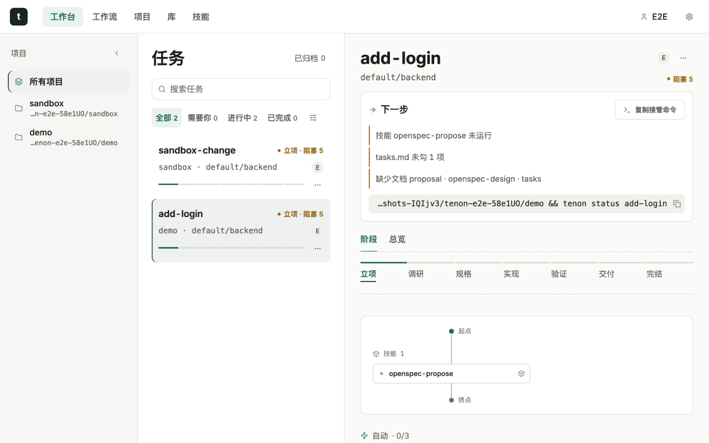
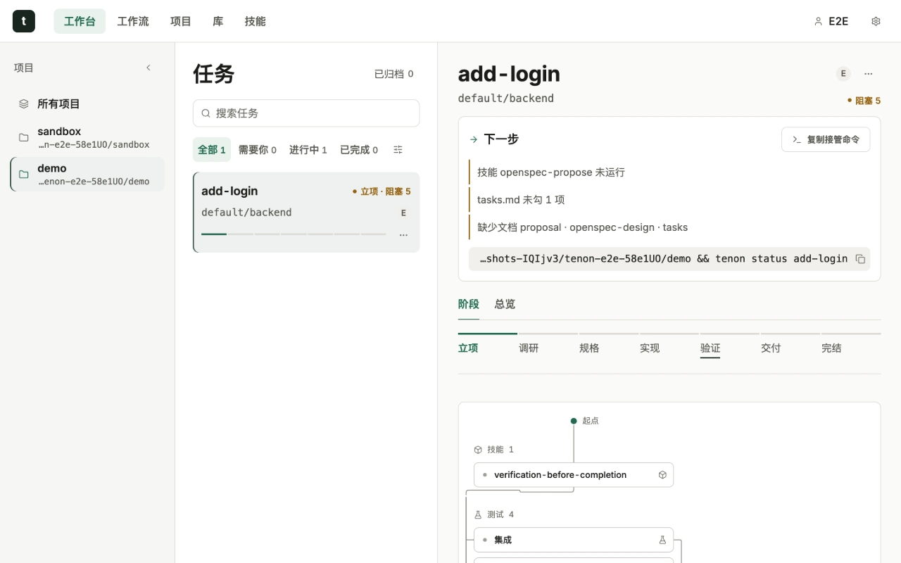
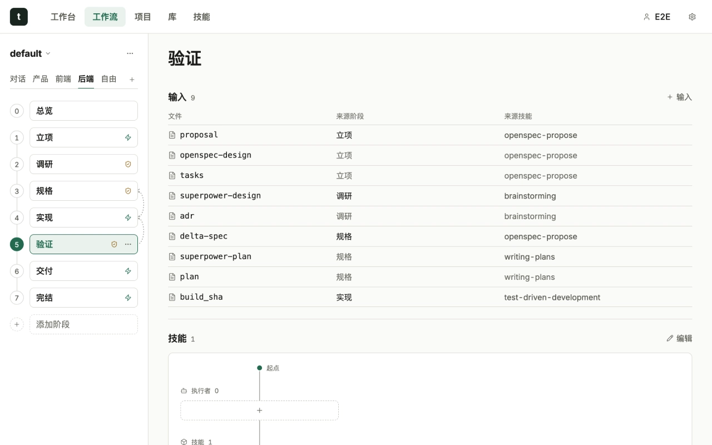
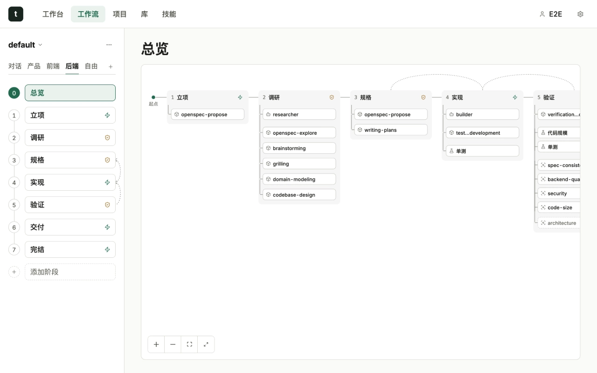

# Dashboard 与本地 API

Dashboard 是本地控制面，不是公共文档托管服务。它显示项目、Change、阶段、Todo、review、AFK、loop 和证据，但不会取代 CLI 的 canonical 状态操作。



项目页先汇总真正需要协助的工作，再进入具体 Workflow。正式截图使用脱敏演示项目，不包含用户目录、凭据或真实业务数据。

## 启动

```bash
tenon dashboard --open
```

`--open` 隐含受管后台启动，等健康检查通过后才打开浏览器。如果 Dashboard 已经在运行，它不会再起一个，而是请已在运行的 server 替你打开浏览器。

默认只绑定 loopback。打开页面后先核对 Tenon 标题、项目 root 和 Change 名，避免把其他端口上的应用误当成当前 Dashboard。

### 登录

Dashboard 不向未登录的调用方提供任何东西：`GET /` 返回 `401` 和一页简短的登录提示，所有 `/api/*` 读写在请求没带会话 cookie 之前都返回 `401`；只有 `/api/health` 和静态 `/assets/*` 公开。没有 token 文件可读，任何响应里也没有能换来访问权的内容。

`tenon dashboard --open` 就是登录方式：server 铸一条一次性登录链接（2 分钟内有效、只能用一次），由 server 自己交给默认浏览器；页面用它换一个 `HttpOnly; SameSite=Strict` 会话 cookie，然后跳转到 `/`。链接不会返回给发起命令的进程，所以仅仅运行这个命令的脚本登录不了。刷新页面靠 cookie 继续有效；会话空闲 12 小时或最长 7 天后失效，且只保存在 server 内存里，重启或升级 server 会让你退出登录。

| 情形 | 怎么做 |
| --- | --- |
| 首次访问、会话过期、重启/升级之后 | 运行 `tenon dashboard --open`（已打开的页面会显示同一句提示和命令） |
| 浏览器窗口提示「登录已失效」 | 再运行一次命令，旧标签页可以关掉 |
| 没有桌面会话（SSH、容器、没有浏览器的 WSL） | 在终端前台运行 `tenon dashboard --port 19765`（任意空闲端口）：前台 server 会打印一条一次性登录链接，在能访问该端口的浏览器里打开 |
| 自己启动 server 的脚本或测试工具 | 设 `TENON_DASHBOARD_PRINT_LINK=1`：server 只把链接打印到启动它的那个进程的 stdout |

只有交互终端，或启动者用 `TENON_DASHBOARD_PRINT_LINK=1` 明确要求时，才会打印链接；受管后台 server 什么都不打印。会话按端口区分：同一台机器上不同端口的两个 Dashboard 不会互相把对方登出。cookie 属于链接里的主机，也就是 `127.0.0.1`；自己手敲 `http://localhost:18765/` 对浏览器来说是另一个站点，会再次看到登录提示。

## 状态为何显示“等待”

“等待”可能代表：

- phase 工作尚未开始；
- review request 已创建，等待确认；
- AFK 任务排队；
- automation 缺少运行时或凭证；
- canonical session 已结束；
- UI 只收到了旧 snapshot。

先运行：

```bash
tenon status <change> --json
tenon inbox --json
tenon doctor --json
```

不要通过删除 marker 或手改 `.pipeline.yaml` 把等待改成运行中。

## 单端口模型

生产 runtime 在同一端口提供 SPA、只读 snapshot、SSE 和受控 mutation API。公共 VitePress 站点不包含这些端点，也不发布用户项目状态。

## Overview

Overview 是 Dashboard 内的只读产品说明，路由为 `?view=overview`。它和正式文档站互补：Overview 帮本地操作者快速定位，正式站提供完整教程、搜索和公共深链。

## 语言

Dashboard `zh/en` 存在浏览器 `localStorage`，只控制 UI。治理文档 locale 在 Change 创建时固定，二者不会隐式联动。

## 安全

不要把 Dashboard 绑定到公网地址。token、prompt、trace、绝对路径和本地 API 响应都可能包含敏感信息。

## 生产端口

安装后的默认 Dashboard 端口是 `18765`。旧测试端口 `19765` 或其他 Vite 端口不是当前生产默认。指定其他端口时仍应只绑定 loopback。

生产 runtime 在一个端口同时提供 SPA、snapshot、SSE 和受控 mutation API。Vite 开发端口只是热更新工具，不是安装契约。

## 状态语义

| 显示 | canonical 事实 | 操作 |
| --- | --- | --- |
| 未开始 | phase 尚未进入 | 等待前序完成 |
| 运行中 | 当前 phase 有活跃工作 | 查看日志与 Todo |
| 等待确认 | exact review pending | 审阅后确认 |
| 已停止 | session 结束或失败 | 查看原因并恢复 |

如果 CLI 显示 `in_progress` 而页面仍显示等待，先刷新 snapshot/SSE，再确认浏览器打开的是当前 Dashboard，而不是旧 preview。



进度页沿真实 Workflow 展示阶段与 Change。`running` 是显示状态，执行来源则独立标记为终端或自动化，避免同一个任务在不同页面出现互相矛盾的身份。

## 操作视图

日常主导航保留五项高频入口：

```text
workspace → workflow → projects → library → skills
```

- `workspace`：按状态查看任务，打开详情执行下一动作；
- `workflow`：编辑 Workflow 与阶段结构；
- `projects`：按项目管理已启用的 agent 客户端，逐个编辑其项目级与用户级指令文件（`AGENTS.md`、`CLAUDE.md`、`GEMINI.md`），并从已有目录或新目录新建项目；新建项目是分步向导（位置 → 模板 → 资源 → 客户端 → 确认），目录只能选择：`POST /api/fs/choose-folder` 在运行 server 的本机弹出系统文件夹对话框，不可用时改用页面内浏览器（`GET /api/fs/list`，同样要 token）；`POST /api/projects/create/stream` 以 `text/event-stream` 逐步回报创建进度；请求体可带 `design_seed`（资源目录里一条 `design-md` 条目），登记前多一步 `design`，用与 `POST /api/design/seed` 相同的逻辑把 DESIGN.md 取到项目根，已有 DESIGN.md 时跳过、不覆盖；
- `library`：指令模板库，内建块随发行包同步，自定义块可复制与修改；以及[智能体](./agents.md)库，按身份分组并显示来源与版本，自定义与项目级可改正文、官方只可复制为自定义（登记在终端用 `tenon agent new`）；
- `skills`：只读查看每个技能的来源、提交、许可证、更新时间与状态。

AFK、Machine、Host Plan 等低频能力从设置面板进入，仍保留原有深链。`hostPlan` 只展示检测结果和零副作用命令计划，不触发安装写操作；需要安装时从明确的项目级安装流程进入。`overview` 独立于操作视图，避免把产品介绍混进日常控制面导航。

### 设置



设置菜单提供主题与语言切换，不改变 canonical Workflow 状态。AFK、机器诊断和宿主计划继续通过 CLI 与本地 API 使用。

### Workflow 工作台



工作台把 Track、七阶段 DAG、每步声明的技能、Hook 与运行前事实放在同一页面。Default 只读基线、自定义 Workflow 和每个 Workflow 的 Free Track 都从同一份有效计划投影。

### 项目

项目页左列只列已注册项目。选中项目后，中列是该项目启用的 agent 客户端；读同一个项目级文件的客户端（例如多个客户端都读 `AGENTS.md`）合并为一行。每个客户端可切换编辑项目级或用户级指令文件。启用的客户端随项目保存在 `<项目>/.tenon/clients.json`：

```json
{ "schema": "tenon-clients/v1", "enabled": ["claude", "codex"] }
```

该文件应随项目提交（`.tenon/.gitignore` 只忽略每个用户的 `local/` 目录）。文件不存在时按已有指令文件推断（`CLAUDE.md` → `claude`、`AGENTS.md` → `codex`、`GEMINI.md` → `gemini`）。打开页面与预览都不会新建文件。

- `GET /api/projects/clients?root=<已注册根>` → `{ "enabled": [...], "source": "file" | "inferred" }`；文件格式不合法返回 `409 clients-file-invalid`。
- `POST /api/projects/clients`，请求体 `{ "root", "enabled" }`，整份替换并返回 `{ "enabled": [...], "source": "file" }`。只接受已知客户端 id（其余在 `400 unknown-client` 中列出），去重排序后原子写入；需要声明身份（`412 user-missing`），每次写入追加一行审计；外部并发修改返回 `409 clients-file-changed`。

### 技能

技能页（`?view=skills`）只读列出 Tenon 自有技能与 `skills/sources.yaml` 声明的上游技能：来源仓库与目录、已安装提交（变化时给出上一提交的对比链接）、许可证、更新时间与状态。数据来自 `GET /api/skills/sources`，即 setup/update 写入的 `skills/skills.lock.json` 与最近一次获取结果，页面本身不联网、不触发安装。

### 测试

Dashboard 只读取测试数据、只编辑工作流的测试策略，不运行也不登记测试（那是 `tenon test ...` 的事）。项目页有「客户端 / 测试」分段（目录套件、按机器画像的基线、已知失败）；工作台任务有「测试」页签（策略矩阵、场景追溯、未登记文件）和运行抽屉（失败用例、产物、覆盖率、基准对基线、日志）；工作流页编辑各阶段的 `test_policy`；库里的测试模板只读。

- `GET /api/tests/catalog?root=` → 解析后的目录（`missing`、带行号问题的 `invalid`、或 `ok`）、已知失败、各套件最近结果。
- `GET /api/tests/baselines?root=&suite=` → 按机器画像的基线与历史。
- `GET /api/tests/plan?root=&change=` → 任务测试计划状态（`missing`、`tampered`、`ok`）。
- `GET /api/tests/records?root=&change=[&suite=]` → v2 运行记录（新的在前）与哈希链状态；不在完好链上的记录标 `trusted: false`。
- `GET /api/tests/record?root=&change=&user=&run=` → 一次运行的失败用例、覆盖率、基准指标、服务与逐文件产物索引（`present` 表示本机文件是否还在）。
- `GET /api/tests/artifact?root=&change=&user=&run=&path=` → 该次运行产物目录内的单个文件。路径必须是不含 `..` 的相对路径，目标必须是真实路径仍在运行目录内的普通文件（对已打开的 inode 再核对一次），超过 64 MiB 返回 `413`。图片和视频内联，zip 与 HTML 只作附件；所有响应都带 `nosniff`、`Content-Security-Policy: sandbox`，以及带原文件名的 `Content-Disposition`（`attachment; filename="trace.zip"` 或 `inline; filename="home.png"`；文件名含非 ASCII 时补 RFC 5987 的 `filename*=UTF-8''…`），下载存下来的仍是原名，不会变成 `artifact.zip`。

`GET /api/snapshot` 里每个 change 还带 `testPolicy`（每个声明了策略的阶段的判定）、`testPlan` 与 `testUser`。
每条 `testPolicy` 还把目录里项目级的 `not_applicable` 声明列为 `notApplicable: [{kind, reason, approved}]`（`approved: false` = 还在等评审确认），测试页签据此把已批准的种类显示为「不适用」而不是缺。
Dashboard 自己读的是更轻的「列表层」（见下文「快照分层与缓存」），打开一个任务时才从
`GET /api/change/:name/snapshot` 读这些逐任务的证据。

## 快照分层与缓存

快照分两层。`GET /api/snapshot`（不带 view）是完整快照：每个 change 都带 documents、技能 / agent 运行、测试、
测试策略、规则的 `policy` 块和 `.pipeline.yaml` 全部字段。`GET /api/snapshot?view=list` 与
`GET /api/stream?view=list` 是 Dashboard 加载的那一层：同样的行，去掉逐任务证据（`fields` 只留 `workflow` 与
`automation`，`todo` 只留阶段状态，`workflowRules` 只留由计划决定的部分），每个 change 带一个 `rev`；许多 change
共用的子树（工作流规则、当前步骤的就绪判定、阶段状态、负责人 / 创建者引用）在每个项目里只写一次，放进 `shared`
表，change 用整数指向它。单个任务的证据走 `GET /api/change/:name/snapshot?root=<项目根>`：与完整快照里该任务
同一个对象，另带 `rev`（查看者已归档的任务还带 `archive`）。列表行的 `rev` 会在该任务的任何输入变化时变掉，
读取方据此在 `rev` 变化时重读详情。30 个项目 × 每项目 30 个任务时，列表响应约 0.65 MB（gzip 后约 22 KB），
完整快照是 11 MB。

列表流先发一个完整的 `snapshot` 事件，之后只发 `snapshot-delta` 事件：序列化字节变了的项目，加上 `roots`
（注册表顺序，被移除的项目随之消失）；不带 `view=list` 的流仍然每次整份重发完整快照。

快照按项目缓存。每个项目的列表构建、完整构建和任务详情都以该项目自己的输入指纹（状态、tasks、documents、
测试记录目录、归档、git HEAD、终端心跳、查看者身份）为键，所以一个项目里的变化只重建这个项目。未变化的构建
最多复用 30 秒，沿用原来的 `generated_at`；每次读取最多刷新四个过期项目，服务刚起时不会在同一刻全部过期成一次
巨大的重建。写请求在结束后丢掉它点名的项目（query 或 JSON body 里的 `root`），query 里点名时开始前也丢；
没有点名任何项目的写丢掉全部。并发读取共用一次构建。`/api/snapshot`、`/api/change/:name/snapshot` 与 AFK
快照 / 日志视图共用这些构建；快照与任务详情响应带 `ETag`，`If-None-Match` 命中返回 `304`，接受 gzip 的调用方拿到压缩字节。

### Server 日志

server 把自己的 stdout/stderr 镜像进 `<state>/logs/dashboard.log`（按大小轮转，共 3 个文件：当前 + `.1` + `.2`，每个 1 MiB），
并把意外的 `500` 记成 `[dashboard-server] 500 <方法> <路径>: <消息>`（从不记录查询串）。凭证、cookie 与一次性登录码在
落盘前已抹掉。用 `tenon logs [--follow] [--lines N]` 查看；`tenon support bundle` 会把最近的部分打进诊断包并再次脱敏。

## 本地 API 边界

mutation 端点必须经过 CLI 相同的 schema、CAS、review 和 guard。前端不能直接编辑 canonical JSON 或 `.pipeline.yaml`。

除 `/api/health` 与 `/assets/*` 外，每个请求都要：

- 通过 loopback Host 校验（读请求也一样，DNS 重绑定读不到任何东西）；
- 带有效会话 cookie（见上文「登录」）；
- 通过浏览器 Fetch-Metadata 检查：被标为跨站的请求直接拒绝，`Origin` 不是 Dashboard 自己的写请求也拒绝。

写请求另外要：

- 写 token——它只嵌在服务给已登录会话的页面里（没有会话的 `GET /` 里没有 token）；
- JSON content type、有界请求体，以及涉及文件系统时的已注册项目 root。

在 Dashboard 里批准评审还要证明「人在场」：页面会让你二次确认，确认那一下才去请求一次性 nonce（`POST /api/change/<name>/decisions/presence`，绑定你的会话、change、评审 ref 与 revision，30 秒有效、只能用一次），`POST /api/change/<name>/decisions` 必须在 `X-Tenon-Presence` 头里带上它。终端里的 `tenon review acknowledge` 规则不变。

`GET /api/host-targets` 与
`GET /api/host-target-plan?host=codex&operation=setup` 是严格只读端点，只接受
Tenon 已注册宿主以及 `setup`/`update` 操作，返回
`host-target-plan/v1`，不会执行预览命令。原生宿主计划面向用户级安装；适配器宿主计划使用
当前项目目录（`--target .`），不会输出可被 shell 误解的占位符。

readiness 里 `step-exit` 类阻断（`readinessByTransition[...].blockers[]`）的 `message` 是给人读的整句（与 CLI 同一份，页面只放进
Tooltip），机器可读的部分是 `code`、`source` 和可选的 `subject`、`state`、`count`：`subject` 是被阻断的对象（文档 kind、技能 token、
测试显示名、宿主不符的评审者），`state` 是它的状态（文档 `missing|stale|unread`、技能 `not-run|unrecorded`、内联测试 `running|missing|stale|failed`，
测试策略阻断里的 `integrity` 与 `diff-unavailable`——它们不指向某一个测试，所以没有 `subject`，评审者的 `wrong-host`，此时 `code: reviewer-wrong-host`），
`count` 是 `tasks.md` 未勾选的项数。Dashboard 只按 `code` 与这些字段给阻断贴短标签，从不解析 `message`；缺这些字段的阻断显示整句。
`tenon status --json` 的 `exits[].blockers[]` 有同样的字段。评审者阻断另以 `agents-incomplete` 阻断投影（`agents[]` 里每项 `agent` 与 `reason`，
`reason` 是 kernel 的阻断码，如 `reviewer-wrong-host`）。

生产 server 会为可压缩的生成资源协商 gzip，并返回 `Vary: Accept-Encoding`；明确拒绝 gzip
的客户端仍获得原始字节，API JSON 继续使用 `no-store`。

```bash
lsof -nP -iTCP:18765 -sTCP:LISTEN
curl -fsS http://127.0.0.1:18765/api/health
```

`/api/health` 是唯一不需要会话的 API 读：它带 release 与状态域身份，只监听 18765 的进程不等于就是正确的 Dashboard。其余读（`/api/snapshot` 等）对 `curl` 一律返回 `401`，这是有意的；请用对应的 CLI 命令，或已登录的浏览器。

页面标题、项目 root 和 Change 必须与目标一致；端口可访问不等于页面就是当前插件。

## 页面验收

- 桌面与移动布局无溢出；
- 中文和英文切换可用；
- 键盘焦点、跳转链接和按钮名称可辨识；
- Todo 与真实 workflow 步骤一致；
- 等待、运行中、确认中与 CLI 一致；
- 控制台无资源 404 或运行时错误。

公共分享请使用静态文档站，不要给 Dashboard 建公网隧道或反向代理。
